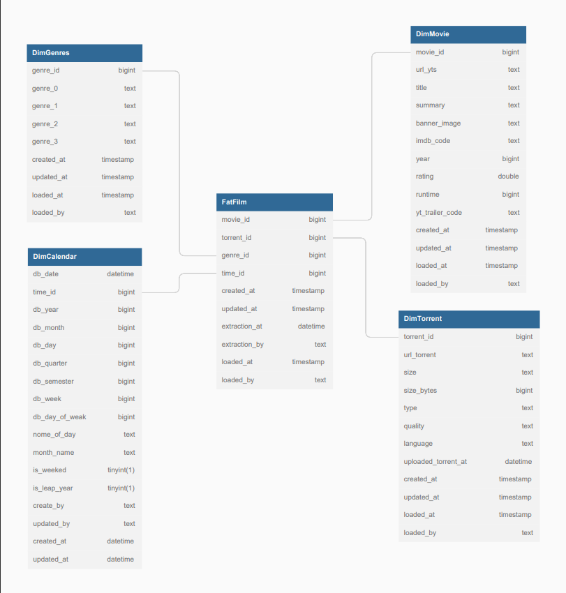
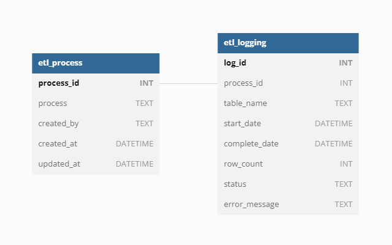
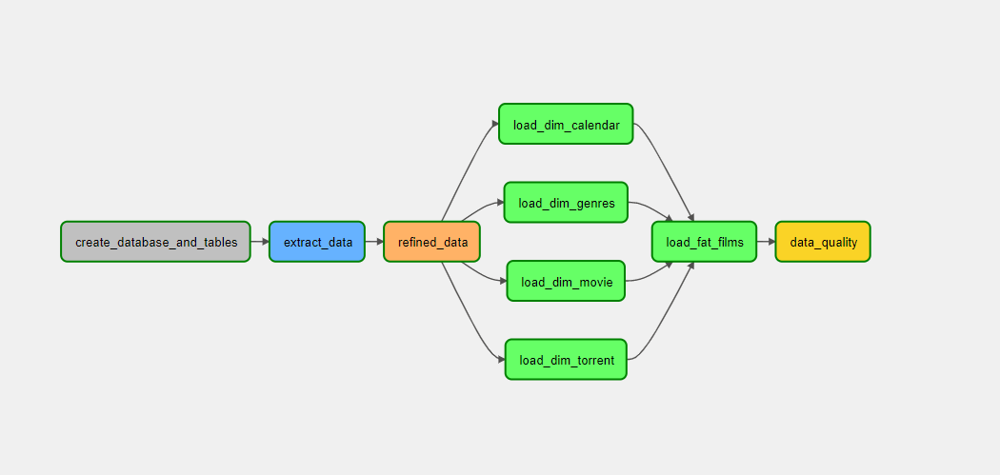

# ETL Yts Movies 📽️
## Overview 📑
This ETL is a sample of my coding work with python using *Apache Airflow* for pipeline orchestration, *Pandas* for data manipulation, *MySql* as storage and *Apache Superset* for data visualization.

This process uses the **YTS Movies API**, a public API for developers, as data sources. 
For more information about this API [click here](https://yts.torrentbay.to/api).

# Pipeline workflow

## Step-By-Step
1. The first step in this process is to create the database and tables.

2. The second step is to extract the data from the api and store it in MySql in the bronze database.

3. The third step is data refinement and storage in silver database in MySql

4. The last step is to load the data and create the star schema model and store the data in the gold database in MySql

# Techniques and Tools 🛠️

- Incremental data load
- ETL logs
- Star Schema Model
- Python ( *Pandas* , *POO* )
- SQL
- Apache Airflow
- Apache Superset
  
# Database Desgins ✏️

* For this project, the star schema is used to design tables. In this way, it simplifies queries and provides fast data aggregation.

---

* For process control two tables were created, **etl_logging** to save the process execution steps and **etl_process** to define the type of process

# Sample Data Visualization

* This is an example of a dashboard template for data visualization, build in apache superset.
  

# Apache Airflow Pipeline

* This is what the airflow dag looks like:

