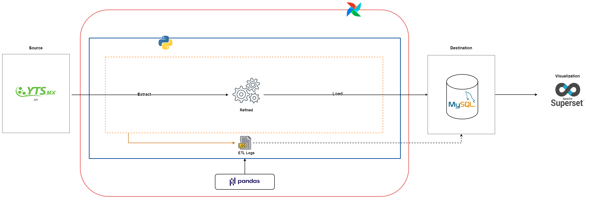
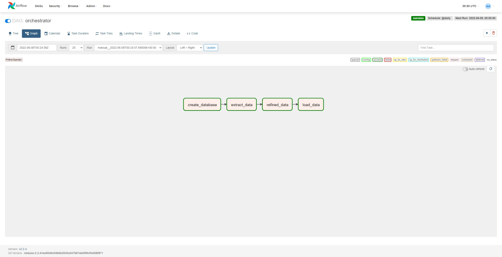

# ETL Yts Movies 📽️
## Introducion 📑
This ETL is a sample of my coding work with python using *Apache Airflow* for pipeline orchestration, *Pandas* for data manipulation, *MySql* as storage and *Apache Superset* for data visualization.

This process uses the **YTS Movies API**, a public API for developers, as data sources. 
For more information about this API [click here](https://yts.torrentbay.to/api).

### This is the pipeline workflow:

---
# Techniques and Tools 🛠️

- Incremental data load
- ETL logs
- Star Schema Model
- Python (*Pandas*)
- SQL
- Apache Airflow
- Apache Superset

---
# Sample Data Visualization

---

# Apache Airflow
This is what the airflow dag looks like:

